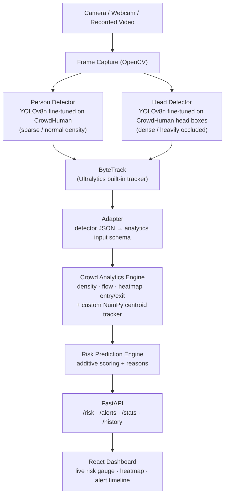

# Architecture

## System diagram



Everything above the dashboard runs on the same local device (Raspberry Pi target). Nothing in this path calls out to the internet.

## Modules and data flow

| Stage | Module | Input | Output |
|---|---|---|---|
| 1. Detection | `people_detection/` | Raw video frame | Per-frame JSON: `people_count`, `detections[]` (bbox + confidence + track id from ByteTrack) |
| 2. Adapter | `integration/adapter.py` | Detector-stage JSON | Analytics-stage input (`FrameInput` shape: `frame`, `timestamp`, `camera_id`, `image_size`, `detections[bbox as list]`) |
| 3. Analytics | `crowd_analysis/analytics/` | Adapted frame input | `crowd_metrics`: people count, density grid, normalized density, flow histogram, entry/exit counts, stationary tracks, heatmap, occupancy growth |
| 4. Risk scoring | `risk_engine/` (+ `integration/risk_engine_fixed.py`) | `crowd_metrics` | `risk_score` (0–100), `risk_level` (Green/Yellow/Orange/Red), `reasons[]`, `alerts[]` |
| 5. API | `risk_engine/routers/` (FastAPI) | Latest risk record | REST endpoints for the dashboard |
| 6. Dashboard | `dashboard/` (React) | REST/WebSocket from step 5 | Live risk gauge, density heatmap, alert timeline |

Each module was built and unit-tested independently against a shared JSON contract; `integration/` is where they're wired into one live pipeline (`pipeline.py`).

## Why two detection models

A single detector tuned for one crowd density trades off badly at the other extreme: a model tuned for well-separated persons under-counts in dense, heavily-occluded crowds, while a model tuned for dense crowds is unnecessarily heavy/conservative on sparse scenes. SentinelX therefore fine-tunes two detectors from the same CrowdHuman source and switches based on scene density:

- **Person (body) model**: full-body boxes, used for normal/sparse density where body-level detection is reliable and gives cleaner tracking (bigger, more stable boxes for ByteTrack).
- **Head model**: Head detection is typically more robust than full-body detection in dense crowds because heads stay visible even when bodies are heavily occluded.

## Why a second, custom tracker in the analytics engine

ByteTrack (via Ultralytics) handles robust, real-time person tracking at the detection stage. The crowd-analytics engine re-derives its **own** lightweight NumPy-only centroid tracker (`crowd_analysis/analytics/tracker.py`) instead of consuming ByteTrack's IDs directly, because:

- It's dependency-free and cheap enough to run every frame on a Raspberry Pi, where re-running a second full tracker inside the analytics stage still needs to be near-zero overhead.


## Local vs. cloud components

Which components run where, what (if anything) needs internet, and whether any data ever leaves the device is answered in full in [`docs/LOCAL_AI_VERIFICATION.md`](docs/LOCAL_AI_VERIFICATION.md) 


## Directory layout (integration assumptions)

```
project_root/
  people_detection/       # Stage 1: detection (person model; head model)
    best.pt
    best.py
  crowd_analysis/
    analytics/             # package: analytics_engine.py, config.py, tracker.py, ...
  risk_engine/             # flat modules: models.py, risk_engine.py, alert_engine.py, database.py
  dashboard/               # React + Vite + Tailwind
  integration/
    adapter.py             # detector-JSON -> analytics-input converter
    risk_engine_fixed.py   # corrected calculate_risk()
    pipeline.py            # single-process orchestrator (no HTTP hop)
```

## Key design decisions (summary)

- **Fine-tune, don't train from scratch**: short, low-LR fine-tune from COCO weights on CrowdHuman avoids the overfitting seen training YOLOv8 on CrowdHuman from zero.
- **Single-class detection** (`single_cls=True`): the risk engine only needs "is this a person," not category, so the detector is simplified and lighter for edge inference.
- **Explainable, additive risk scoring** instead of a black-box model: every score ships with the specific `reasons` that produced it, which is a hard requirement for an operator-facing safety tool.
