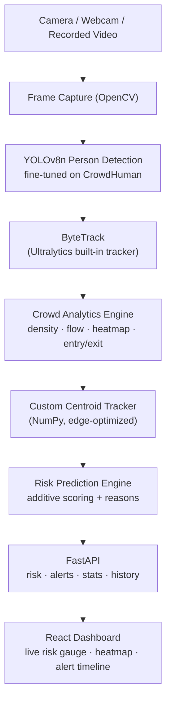
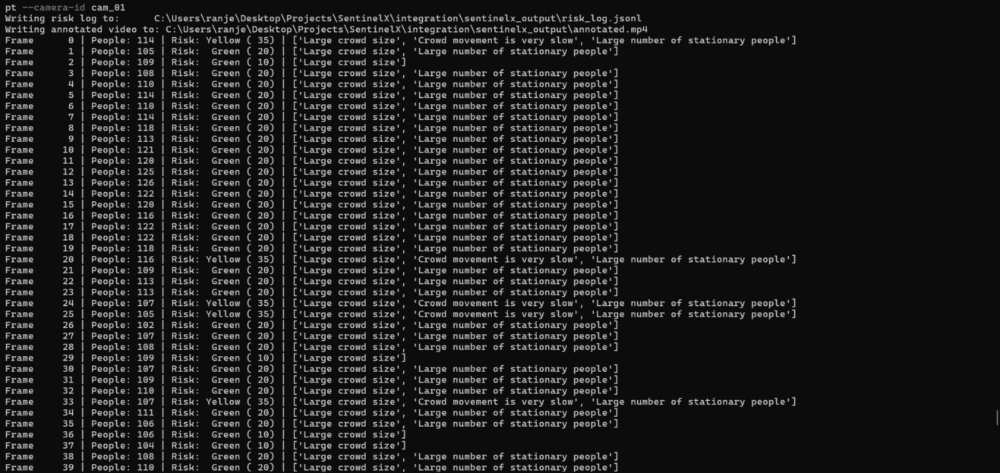
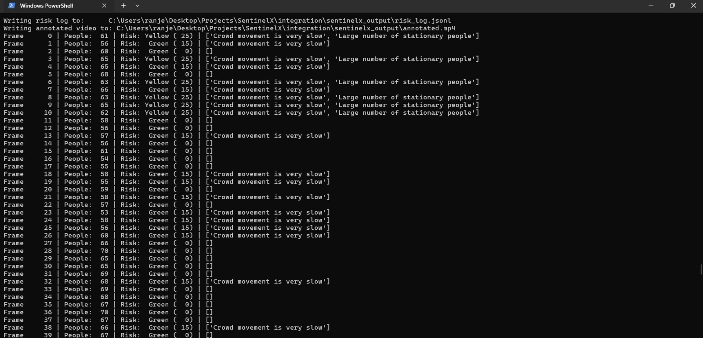

<div align="center">

## SentinelX


<a href="#"></a>
<a href="#"></a>
<a href="#"></a>
</div>
<br/>

**SentinelX** turns existing CCTV cameras into an intelligent, offline-capable crowd safety layer. It runs a fine-tuned person detector, an accurate tracker, a rule-based risk-scoring engine, and a live dashboard entirely on local edge hardware, so a venue can move from *reactive recording* to *proactive risk prediction* without adding a single new camera or a cloud bill.

This document describes the system as it stands at the **mid-evaluation checkpoint** : four modules, built and independently tested in parallel, now heading into integration.

---

## Table of Contents

- [Project Status](#project-status)
- [Problem Statement](#problem-statement)
- [Solution](#solution)
- [Why It Matters](#why-it-matters)
- [On-Device AI](#on-device-ai)
- [Model Selection](#model-selection)
- [Risk Scoring Logic](#risk-scoring-logic)
- [System Architecture](#system-architecture)
- [Tech Stack](#tech-stack)
- [Storage & Resource Footprint on Raspberry Pi](#storage--resource-footprint-on-raspberry-pi)
- [Screenshots](#screenshots)
- [Demo Video](#demo-video)
- [Getting Started](#getting-started)
- [Team](#team)
- [Limitations](#limitations)
- [Future Scope](#future-scope)
- [License](#license)

---

## Project Status

SentinelX is being built as four independent, individually-testable modules that converge into one pipeline. At this checkpoint:

| Module | State | Evidence |
|---|---|---|
| Person Detection | Functional standalone pipeline | `best.py` runs live tracking end-to-end and writes structured JSON output per frame |
| Crowd Analytics | Engine complete, fully unit-tested | Ten analytics submodules (density, flow, heatmap, entry/exit, trajectory, tracker) with a matching `pytest` suite for each |
| Risk Prediction Engine | Scoring logic and REST API complete | `risk_engine.py` implements the full scoring model; FastAPI routers for `risk`, `alerts`, `stats`, `history` are live and verified against `sample_data.json` |
| Dashboard | UI complete, running on mock data | All components built against a mock data layer shaped to match the backend schema, for a drop-in swap once endpoints are wired up |
| End-to-end integration | In progress | Modules are verified independently; connecting live detection → analytics → risk API → dashboard is the current focus |


---

## Problem Statement

Large public gatherings: railway and metro stations, temples, stadiums, concerts, malls, festivals, college fests, routinely become overcrowded. Traditional CCTV is reactive: it records what happened, it does not stop it from happening.

A single control-room operator cannot reliably watch dozens of live feeds and catch the early signs of risk: rising density, a crowd pressing against a blocked exit, opposing movement in a corridor, before they escalate into an emergency.

## Solution

SentinelX ingests existing CCTV/webcam feeds and runs the full crowd-intelligence pipeline **on local edge hardware**:

- Detects and counts people per frame with a person detector fine-tuned for dense, occluded crowds
- Tracks individuals across frames to understand motion, not just headcount
- Estimates crowd density, builds live heatmaps, and classifies movement flow (uniform vs. mixed/opposing)
- Detects congestion, entry/exit imbalance, and stationary buildup
- Combines these signals into a single, explainable risk score with human-readable reasons
- Surfaces everything on a live analytics dashboard

## Why It Matters

| | |
|---|---|
| Privacy-preserving | Video never leaves the device: no frames are uploaded to any cloud |
| Low latency | Inference happens locally, so alerts fire without a network round trip |
| Low cost | Runs on a Raspberry Pi: no GPU server, no recurring cloud bill |
| Works offline | The core safety pipeline has zero dependency on internet connectivity |
| Retrofit-friendly | Uses cameras that are already installed: no new hardware on-site |
| Explainable | Every risk score ships with the specific reasons that produced it, not a black-box number |

---

## On-Device AI

Every stage of the detection → tracking → analytics → risk pipeline executes locally. Internet, where used at all, is limited to optional secondary features (e.g. pushing an alert notification): never the core inference path.

| Item | Detail |
|---|---|
| Detection model | YOLOv8n (Ultralytics), fine-tuned |
| Fine-tuned on | [CrowdHuman](https://www.crowdhuman.org/): converted to a single `person` class |
| Base checkpoint | `yolov8n.pt` (COCO-pretrained) |
| Fine-tuning method | Short, low-LR fine-tune from COCO weights, not trained from scratch, to avoid the overfitting seen when training YOLOv8 on CrowdHuman from zero |
| Fine-tuning config | 25 epochs, image size 640, batch 16, SGD, `lr0=0.001`, cosine LR schedule, early stop patience 10, `single_cls=True` |
| Resulting weights | `best.pt`: measured **6.0 MB** on disk |
| Export path | `best.pt` → ONNX (`simplify=True`) via the same fine-tuning script, for the edge-deployment build |
| Detection-stage tracker | ByteTrack, via Ultralytics' |
| Analytics-stage tracker | A custom, dependency-free (NumPy-only) centroid tracker |

**Why a second, custom tracker in the analytics engine?** 
ByteTrack is used for robust person tracking, while the analytics engine uses a lightweight NumPy-only centroid tracker for analytics such as entry/exit counting and occupancy monitoring. This reduces computational overhead and is well suited for real-time deployment on Raspberry Pi

---

## Model Selection

Before committing to YOLOv8n, three nano-scale detectors were benchmarked head-to-head on the same 8 test images and 2 test videos (dev-machine CPU, pre-fine-tuning):

| Model | Persons Detected (8 imgs) | Avg. Confidence | Avg. Inference (ms/img) | Video Throughput (FPS) |
|---|---|---|---|---|
| YOLOv8n | 80 | 0.427 | 110.7 | 11.2 – 14.6 |
| YOLO11n | 63 | 0.462 | 100.9 | 10.3 – 14.5 |
| YOLO26n | 88 | 0.326 | 102.1 | 10.9 – 14.0 |

YOLOv8n was selected as the base for fine-tuning: it detects substantially more persons than YOLO11n while holding a materially higher average confidence than YOLO26n, giving the most usable precision/recall balance for a downstream risk engine that reasons over confidence-weighted counts. Raw benchmark artifacts are in `people_detection/testing/benchmarks/`.

---

## Risk Scoring Logic

The risk engine (`risk_engine.py`) computes an explainable, additive risk score from crowd-analytics output — not a black-box model:

| Signal | Condition | Score Added |
|---|---|---|
| Crowd size | `people_count > 150` | +20 |
| Crowd size | `80 < people_count ≤ 150` | +10 |
| Zone density | max zone count `> 10` | +30 |
| Zone density | max zone count `5–10` | +15 |
| Movement speed | average speed `< 50` (very slow / stalled crowd) | +15 |
| Movement flow | classified as `Mixed` (opposing movement) | +20 |
| Occupancy growth | growth `≥ 3` (rapid buildup) | +15 |
| Stationary buildup | `> 20` stationary tracks | +10 |
| Stationary buildup | `5–20` stationary tracks with `people_count > 10` | +5 |
| Entry/exit imbalance | entries exceed exits by `> 10` | +10 |

Score is capped at 100 and mapped to a risk level:

| Score | Level |
|---|---|
| 0 – 24 | Green |
| 25 – 49 | Yellow |
| 50 – 79 | Orange |
| 80 – 100 | Red |

Every response includes the specific `reasons` that contributed to the score, so an operator sees *why* a zone turned Orange, not just that it did.

---

## System Architecture



---

## Tech Stack

### Module 1: Person Detection (`people_detection/`)

| Tool | Version |
|---|---|
| Python | 3.11 |
| Ultralytics (YOLO) | `>=8.3.0` |
| OpenCV (`opencv-python`) | `>=4.9.0` |
| Pillow *(fine-tuning)* | `>=10.0.0` |
| tqdm *(fine-tuning)* | `>=4.66.0` |
| huggingface_hub *(fine-tuning)* | `>=0.24.0` |
| Tracker | ByteTrack |

### Module 2: Crowd Analytics (`crowd_analysis/`)

| Tool | Version |
|---|---|
| Python | 3.11 |
| NumPy | latest stable |
| pytest | latest stable |
| Tracking algorithm | Custom greedy centroid tracker (dependency-free) |

### Module 3: Risk Prediction Engine (`risk_engine/`)

| Tool | Version |
|---|---|
| Python | 3.11 |
| FastAPI | `0.139.0` |
| Uvicorn | `0.51.0` |
| Pydantic | `2.13.4` |
| pydantic_core | `2.46.4` |
| Starlette | `1.3.1` |
| anyio | `4.14.1` |
| h11 | `0.16.0` |


### Module 4: Dashboard (`dashboard/`)

| Tool | Version |
|---|---|
| React | `^18.3.1` |
| React DOM | `^18.3.1` |
| Vite | `^5.4.8` |
| Tailwind CSS | `^3.4.13` |
| PostCSS | `^8.4.47` |
| Autoprefixer | `^10.4.20` |
| Chart.js | `^4.4.4` |


### Deployment Target

| Device | Role |
|---|---|
| Raspberry Pi 4 / 5 | Primary low-cost edge target |

---

## Storage & Resource Footprint on Raspberry Pi

Measured and estimated footprint on a Raspberry Pi 4/5, 64-bit Raspberry Pi OS:

| Component | Size |
|---|---|
| Fine-tuned detection weights (`best.pt`) | 6.0 MB *(measured)* |
| ONNX export of `best.pt` | ~6–8 MB *(estimate)* |
| Ultralytics + ONNX Runtime (ARM) | ~40–90 MB |
| OpenCV (`opencv-python-headless`) | ~40–90 MB |
| Python 3.11 + virtual environment | ~150–250 MB |
| FastAPI + Uvicorn + dependencies | ~20–30 MB |
| React production build (static assets) | ~5–15 MB |
| **Estimated total application footprint** | **~260–480 MB** |
| Recommended SD card | 16 GB minimum, 32 GB recommended |

---

## Screenshots

<p align="center">
  
</p>

<p align="center">
<b>Figure 1.</b> Risk analysis on a dense crowd scene, showing real-time people count, risk level, and contributing factors such as crowd size, slow movement, and stationary individuals.
</p>

---

<p align="center">
  
</p>

<p align="center">
<b>Figure 2.</b> Real-time crowd risk monitoring on a moderately dense scene, displaying dynamic people count, risk score, and detected behavioral indicators.
</p>

---

## Demo Video

https://drive.google.com/file/d/1FeKDpo0MTFF213wiEYRrtf67_h5EDE21/view?usp=sharing

---

## Getting Started

### Prerequisites

- Python 3.11+
- Node.js 20+ and npm
- A webcam, CCTV RTSP stream, or a sample video file

### 1. Clone the repository

```bash
git clone https://github.com/<your-username>/SentinelX.git
cd SentinelX
```

### 2. Person Detection module

```bash
cd people_detection
pip install -r requirements.txt
# best.pt (fine-tuned weights) should already be in this folder
python best.py
```

### 3. Crowd Analytics module

```bash
cd ../crowd_analysis
pip install numpy pytest
pytest test/          # run the analytics test suite
```

### 4. Risk Engine (FastAPI backend)

```bash
cd ../risk_engine
pip install -r requirements.txt
uvicorn app:app --reload --host 0.0.0.0 --port 8000
```

### 5. Dashboard

```bash
cd ../dashboard
npm install
npm run dev
```

Open the printed local URL to view the dashboard (currently backed by mock data; swapping to live FastAPI/WebSocket endpoints is the integration step in progress).

---

## Team

| Module | Responsibilities | Author |
|---|---|---|
| Person Detection | YOLOv8n fine-tuning, live detection/tracking pipeline, benchmarking | Sriza Goel |
| Crowd Analytics | Density, heatmap, flow, entry/exit, custom edge-optimized tracker | Ranjeet Kaur |
| Risk Prediction Engine | Risk scoring model, FastAPI REST API, alerting | Khushii Duggal |
| Dashboard & Visualization | React dashboard, live risk gauge, heatmap view, alert timeline | Toyesh Gupta |

---

## Limitations


- Performance may decrease in extremely dense crowds with severe person occlusions.
- Detection accuracy depends on camera placement, viewing angle, and video quality.
- The system is designed as an early-warning aid and should complement, not replace, human monitoring.
- Thresholds for risk estimation may require calibration for different venues and crowd dynamics.
- Environmental conditions such as poor lighting, rain, or fog can reduce detection reliability.

## Future Scope

- Drone-based crowd monitoring
- Fire and smoke detection module
- Mobile application support
- Emergency evacuation guidance
- Digital twin visualization of venues

---

## License

Developed as part of a hackathon submission for educational and research purposes.

Original SentinelX code is released under the **MIT License** : see [`LICENSE`](./LICENSE).


<div align="center">
<br/>
<sub>SentinelX - Prevent. Protect. Predict.</sub>
</div>
